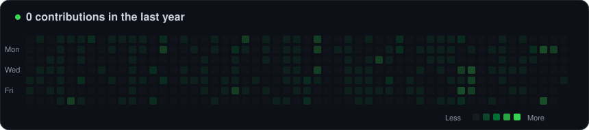

# 👋 Hi, I'm Mouhcine Khairat

### 🤖 AI & Full-Stack Engineer

I design and build intelligent, scalable applications by combining **Artificial Intelligence, Full-Stack Development and Software Engineering**.

🔭 **AI-powered applications, WMS & ERP systems** · 🧠 **ML, Deep Learning, RAG & AI Agents** · ⚙️ **.NET, React, Flutter & Python**

## 🌐 Connect with me

<h3><code>mouhcine@github ~ $ whoami</code></h3>
<table><tr><td valign="top"></td><td valign="top"></td></tr></table>

# 💻 Tech Stack

**AI / ML:** `Python` `TensorFlow` `PyTorch` `scikit-learn` `RAG` `Fine-Tuning` `AI Agents` `LLMs`  
**Backend:** `.NET` `C#` `Python` `Java` `Spring Boot` `Laravel` `Flask`  
**Frontend:** `React` `Angular` `TypeScript` `JavaScript` `HTML` `CSS` `Bootstrap`  
**Mobile:** `Flutter` `Dart` `Kotlin`  
**Databases:** `SQL Server` `MySQL` `MongoDB` `Oracle`

# 🚀 Featured Projects

### 🏭 WMS — Warehouse Management System

Full-stack WMS with traceability, mobile workflows, fleet operations, dashboards and Microsoft Dynamics 365 Business Central integration.  
**Stack:** `.NET` `React` `Flutter` `SQL Server` `AI` `Business Central`

### 🤖 AI CV & Job Match Engine

`OCR` → `AI Scoring` → `Cultural Adaptation` → `CV Optimization` → `Cover Letter Generation`

### 🧠 Intelligent Flutter AI Application

TensorFlow Lite image classification, fine-tuned AI assistant, RAG, MCP and interactive avatar.

### 🍽️ SmartOrderAI

AI-powered chatbot for restaurant order and reservation management.

# 📊 GitHub Activity

<h3><code>mouhcine@github ~ $ ./contributions.sh</code></h3>

---

<b>🤖 AI × Software Engineering × Real-World Solutions</b> <i>Building intelligent systems from idea to production.</i>

